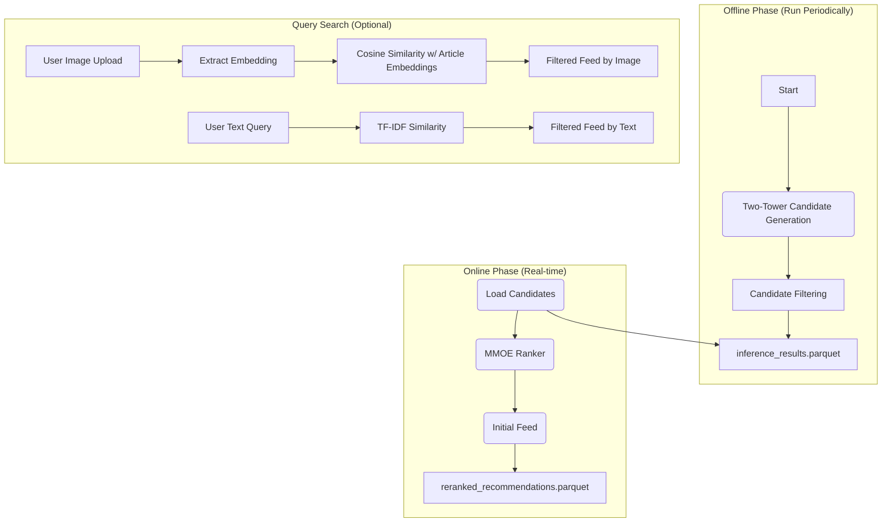

# 🛍️ H&M Two-Step Recommendation Pipeline

This document provides instructions for running the two-step recommendation pipeline. The system first generates candidate articles using a Two-Tower model, optionally filters candidates based on custom logic, then re-ranks them using an MMOE model, and finally offers both **image-based** and **text-based** query search to refine personalized recommendations.

---

## 📐 Pipeline Architecture

The pipeline is structured in **three key stages**:

1. **Candidate Generation (Two-Tower model)**  
2. **Re-ranking (MMOE model)**  
3. **Query Search**  
   - By Image  
   - By Text  



---

## ⚙️ How to Run the Pipeline

### ✅ Prerequisites

Ensure the following are available:

- ✅ Conda environment with required dependencies
- ✅ Dataset files in `data/`:  
  - `articles.csv`, `customers.csv`, `transactions_train.csv`
- ✅ Trained models:
  - Two-Tower: `output/models/model_<version>/model_weights.h5`
  - MMOE Ranker: `output/parquet/model`
- ✅ Precomputed image embeddings: `data/image_embeddings.parquet`

---

### 🔹 Step 1: Generate and Filter Candidates

Navigate to the Two-Tower folder and run inference. A candidate filter module has been added internally in `__inference__.py` for optional rule-based filtering.

```bash
cd two_tower_cg/refactor

# Run inference with optional threshold or filter logic
python __inference__.py -mv v2 --top_k 100
```

📦 Output: `output/inference/inference_results.parquet`  
✨ *Note: This step now includes candidate filtering before saving results.*

---

### 🔹 Step 2: Re-rank Using MMOE

The re-ranking pipeline uses the inference results and customer/article features to produce a final feed per user.

```bash
# Run full pipeline from project root
python recommendation_pipeline.py
```

#### Optional: Re-rank for a specific customer

```bash
python recommendation_pipeline.py --customer_id <valid_customer_id>
```

📦 Output: `output/reranked_recommendations.parquet`

---

### 🔹 Step 3: Run Query Search (Image + Text)

#### 🖼️ Image-Based Search

If `test_img.jpg` and `image_embeddings.parquet` are present:

```bash
# Automatically triggered inside recommendation_pipeline.py
# Top similar articles by visual embedding
```

#### 🔤 Text-Based Search

You can modify the example query inside `recommendation_pipeline.py`, e.g.:

```python
example_query = "floral summer dress"
```

📦 Output:
- Console print of top articles with highest similarity
- `output/final_recs_text_query.json`

---

## 📂 Output Files

| File | Description |
|------|-------------|
| `inference/inference_results.parquet` | Top-k articles per customer from Two-Tower |
| `reranked_recommendations.parquet` | Final re-ranked articles by MMOE |
| `final_recs_img_query.json` | Final articles filtered by image similarity |
| `final_recs_text_query.json` | Final articles filtered by text query |

---

## ✅ Summary of New Features

| Feature | Location | Description |
|--------|----------|-------------|
| 🔎 `filter_candidates` | `__inference__.py` | Optional postprocessing step after Two-Tower output |
| 🔤 `search_by_text()` | `recommendation_pipeline.py` | TF-IDF cosine similarity search on `detail_desc` |
| 🧠 Improved modularity | N/A | Image + Text query unified in a single flow |

---

## 🧪 TODO / Future Work

- Add support for semantic search with pretrained Sentence-BERT
- Expose text/image query search via Flask or FastAPI for real-time usage
- Store embeddings and features in vector DBs (e.g., FAISS, Qdrant)