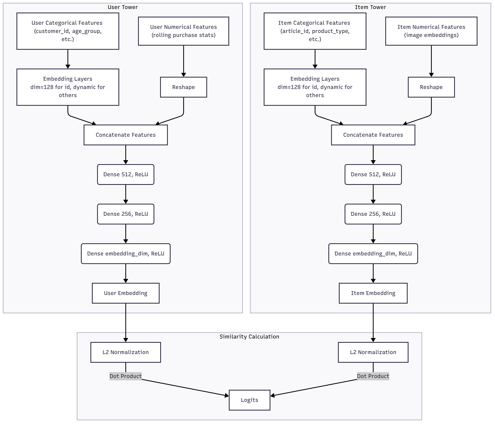
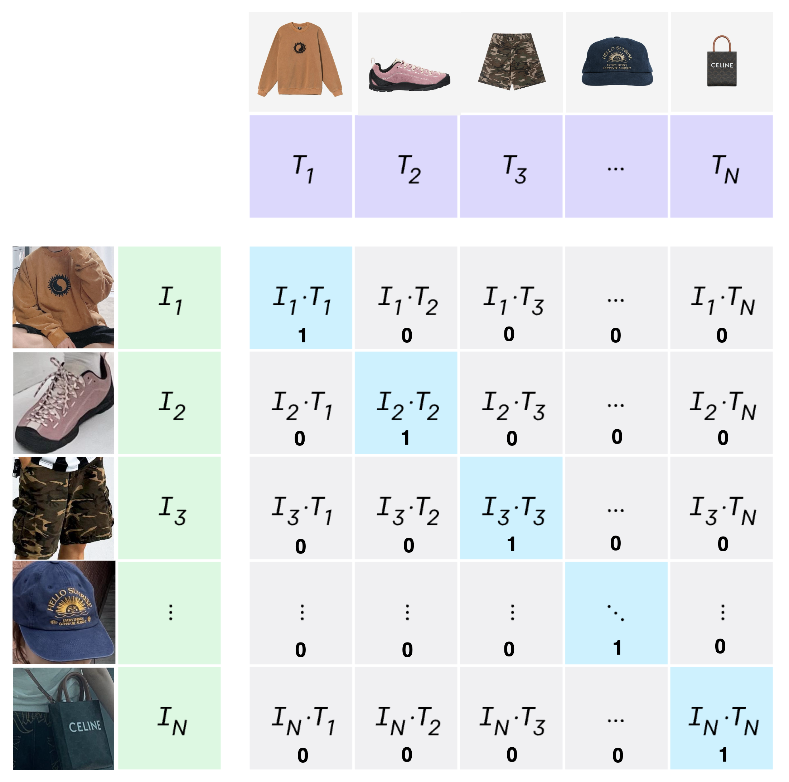
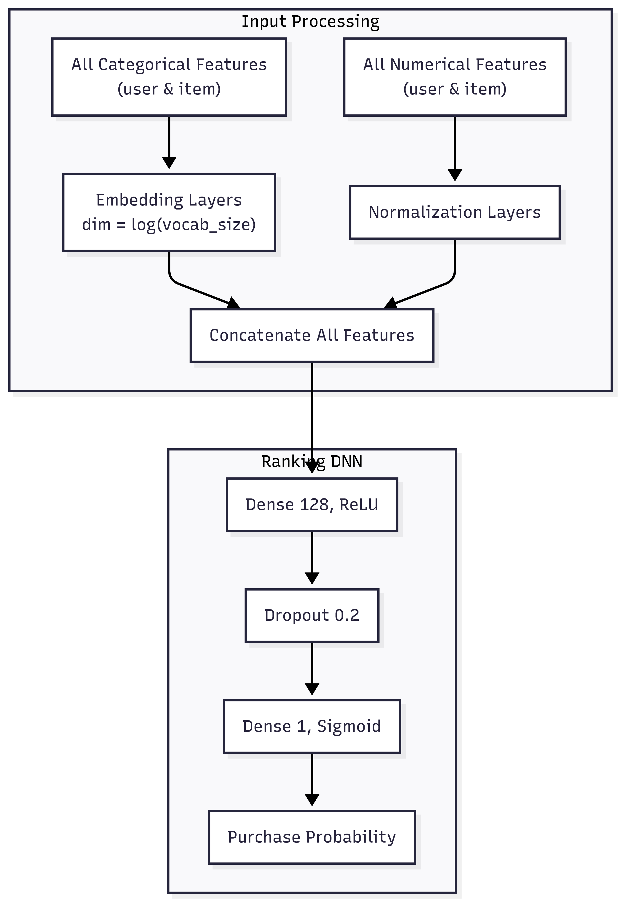
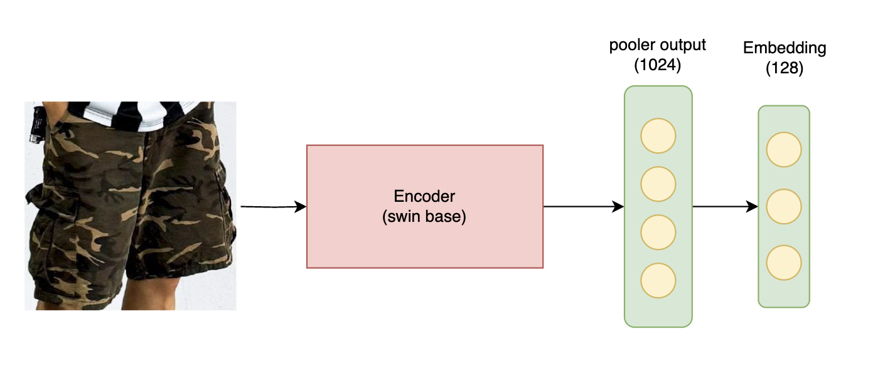
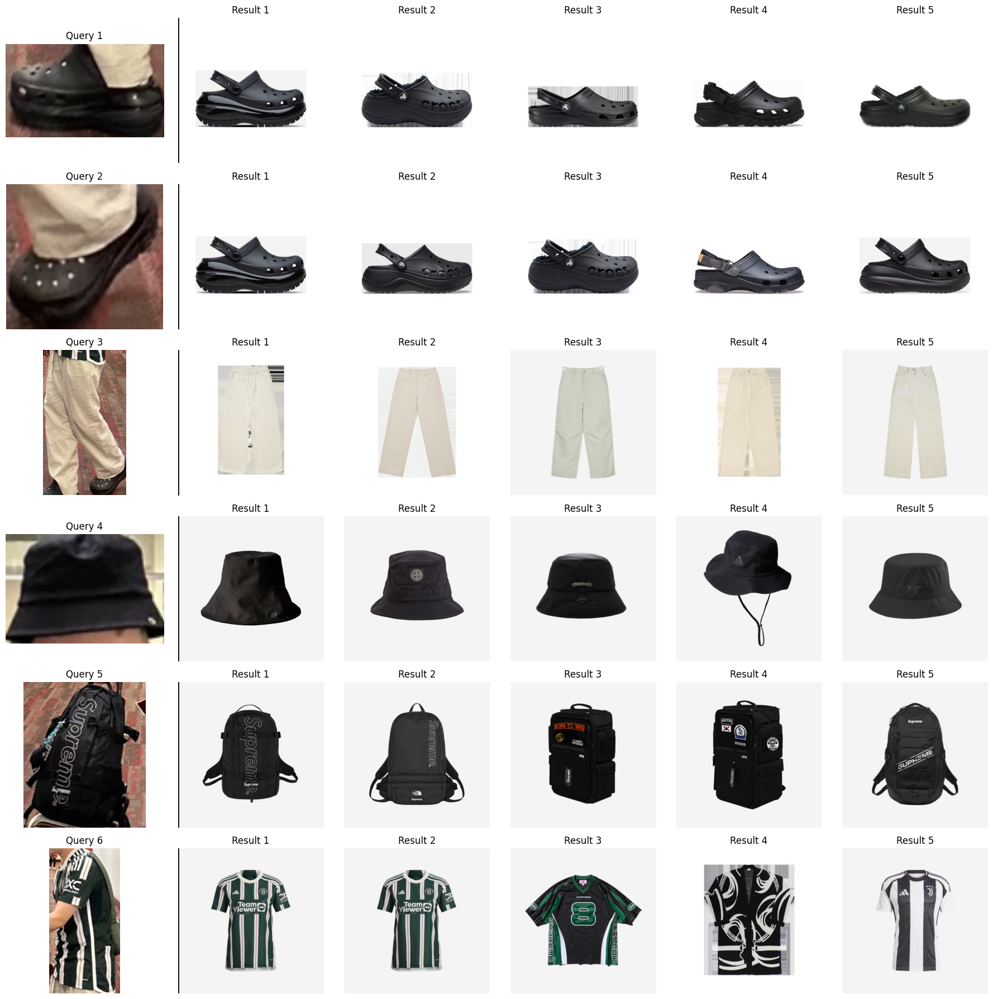

# H&M Recommendation System: Modelling Architecture

This document provides a detailed breakdown of the H&M Recommendation System, outlining the architecture, models, and data flows. The system is composed of two primary sub-systems: an offline pipeline for large-scale candidate retrieval and reranking, and an online service for real-time inference, search, and filtering.

---

## 1. Offline Sub-system: Candidate Retrieval and Initial Reranking

The offline sub-system is responsible for processing historical data to generate personalized recommendations for each user. This is a computationally intensive process that runs in batches. It consists of a multi-stage pipeline that first retrieves a broad set of relevant candidates and then refines this set with a more precise ranking model.

### 1.1. Stage 1: Initial Retrieval (Two-Tower Model)

#### Retrieval Model Overview

The first stage of our offline pipeline is a Two-Tower retrieval model. Its primary goal is **RECALL (or COVERAGE)**: to efficiently scan the entire catalog of millions of articles and retrieve a few hundred of the most relevant candidates for each user. It learns low-dimensional embeddings (vector representations) for both users and items in a shared space, such that items a user is likely to interact with are located closer to the user's vector.

#### Retrieval Input Features

The retrieval model uses a rich set of features to build comprehensive embeddings, especially historical and sequential features for the user.

| Feature Group | Features | Description |
|---|---|---|
| **User Categorical** | `customer_id`, `club_member_status`, `fashion_news_frequency`, `age_interval`, `postal_code` | Static attributes defining the customer. |
| **User Numerical** | `customer_spend_30d`, `customer_articles_30d`, `days_since_last_customer_trans` | Rolling 30-day statistics capturing recent user behavior and spend. |
| **Item Categorical** | `article_id`, `product_type_name`, `product_group_name`, `colour_group_name`, `department_name`, `section_name` | Static attributes defining the product. |
| **Item Numerical** | `img_embd_0`...`img_embd_127` | A 128-dimension vector from a pretrained Vision Transformer, capturing the visual essence of the product image. |

#### Retrieval Model Architecture

The model consists of two identical but separately trained towers—one for the user and one for the item. Each tower processes its respective features and outputs a final embedding vector.

{width=80%}

*Figure 1: Two-Tower Retrieval Model Architecture*

**Architectural Details:**

- **Input Layer**: Each tower accepts a mix of categorical and numerical features.
  - **Categorical Features**: Are passed through `tf.keras.layers.Embedding`. The embedding dimension is set to `128` for high-cardinality features like `customer_id` and `article_id`, and dynamically calculated as `3 * log2(vocabulary_size)` for others.
  - **Numerical Features**: Are reshaped and concatenated with the embeddings.
- **Hidden Layers**: The concatenated feature vector is processed through a feed-forward network consisting of three dense layers:
  1. `Dense(512, activation='relu')`
  2. `Dense(256, activation='relu')`
  3. `Dense(embedding_dimension, activation='relu')` (The final output embedding, where `embedding_dimension` is a configurable hyperparameter).
- **Output Layer**: The model computes the dot product between the L2-normalized user and item embeddings to produce a similarity score (logit).

#### Retrieval: Labeling and Loss Function

##### Labeling Strategy: In-Batch Negative Sampling

To train the model, we use `(user, item)` pairs from actual purchase data as positive examples. For negative examples, instead of sampling from the entire catalog, we employ an efficient technique called **in-batch negative sampling**. 

{width=60%}

*Figure 2: Contrastive Learning Illustration*

For any given user in a training batch, their corresponding purchased item is treated as the positive sample, while all other items in that same batch are treated as implicit negative samples. This converts the training objective into a multi-class classification problem for each user: identifying the true positive item from all items in the batch.

##### Loss Function: Sampled Softmax Cross-Entropy with Log(q) Correction

This retrieval task uses a custom implementation of `sparse_softmax_cross_entropy_with_logits`, which is ideal for two reasons:

1. **Efficiency and Ranking Nature**: Calculating a softmax over millions of items is infeasible. By limiting the universe to the items within a batch, the computation becomes manageable. The softmax function naturally creates a ranking, pushing the model to assign a higher score to the positive item over the in-batch negatives.

2. **Log(q) Correction for Sampling Bias**: In-batch sampling introduces a bias where popular items are more likely to be selected as negatives by chance. A naive model would learn to suppress popular items. To counteract this, we apply a **log(q) correction**. We subtract the logarithm of an item's sampling probability (`q`, its popularity) from its calculated logit before the softmax. This debiasing technique, central to **Sampled Softmax**, ensures the model learns true user preferences rather than simply avoiding popular items.

With your log q correction, the per-example loss for user $i$ with true item $p$ and batch of items $\mathcal{B}$ is:

$$
\mathcal{L}_i \;=\; -\log 
\frac{
  \exp\!\bigl(s(u_i,\,v_p)/\tau\bigr)
}{
  \displaystyle\sum_{j\in\mathcal{B}}
    \exp\!\bigl((\,s(u_i,\,v_j)\;-\;\log q_j\,)/\tau\bigr)
}
$$

where:

* $s(u_i, v_j)$ is the model score (e.g. dot-product) between user $i$ and item $j$,
* $\tau$ is a temperature hyperparameter,
* $q_j$ is the sampling probability (popularity) of item $j$, and
* $\mathcal{B}$ is the set of all items in the same batch (positives + in-batch negatives).

Summing over all users in the batch gives the total loss, which pulls each positive pair together and pushes all in-batch negatives apart.

### 1.2. Stage 2: Reranking (DNN Ranking Model)

#### Reranking Model Overview

Once the Two-Tower model generates a list of ~5000 candidates **<i>(ideally all products above the retrieval threshold of cosine, preset to 0.3 for optimal coverage)</i>**, a more sophisticated **DNN Ranking Model** reranks this smaller set. Its primary goal is **precision**: to predict the actual probability of a user purchasing each candidate item and order them accordingly.

#### Ranking Input Features

The ranking model uses all features from the retrieval stage, plus additional interaction and contextual features that would be too costly for the retrieval model to handle.

| Feature Group | Example Features | Description |
|---|---|---|
| **Customer Attributes** | `age`, `postal_code`, `club_member_status` | Static demographic and loyalty features for the customer. |
| **Article Attributes** | `product_color`, `product_type`, `graphical_appearance` | Static descriptive features of the article. |
| **Customer Historical Stats** | `median_price_last_30d`, `days_since_last_purchase` | Rolling statistics summarizing a customer's recent transaction history and activity. |
| **Article Historical Stats** | `days_since_last_sale`, `color_popularity_last_30d` | Rolling statistics capturing an article's recent popularity and sales velocity. |
| **Customer-Item Affinity** | `price_vs_customer_median` | Cross-features that measure the consistency of an item's attributes with a customer's historical preferences. |
| **Contextual Features** | `sales_channel_id` | Features describing the context of the interaction, such as whether it is online or in-store. |

#### Ranking DNN Architecture

This is a single, unified DNN that takes concatenated features from both the user and the item as input. Unlike the Two-Tower model, it allows for explicit cross-feature interactions between user and item attributes from the very first layer. This enables the model to learn more complex decision boundaries.

{width=60%}

*Figure 3: Ranking DNN Architecture*

**Architectural Details:**

- **Input Layer**: All categorical and numerical features (from user, item, and context) are processed.
  - **Categorical Features**: Are passed through `tf.keras.layers.Embedding` with an output dimension of `log2(vocabulary_size)`.
  - **Numerical Features**: Are standardized using `tf.keras.layers.Normalization`.
- **Hidden Layers**: The concatenated feature vector is passed through a simple but effective feed-forward network:
  1. `Dense(128, activation='relu')`
  2. `Dropout(0.2)` to prevent overfitting.
- **Output Layer**: A final `Dense(1, activation='sigmoid')` layer outputs a single value between 0 and 1, representing the predicted probability of purchase.

#### Ranking: Labeling and Loss Function

##### Labeling Strategy: Pointwise Binary Classification

The ranking model frames the problem as a binary classification task. Each `(user, item)` pair provided to the model is assigned a label:

- **Positive Label (1)**: The user purchased the item.
- **Negative Label (0)**: The user did not purchase the item. These are critically sampled from the high-relevance candidates generated by the retrieval model, creating **hard negatives**. This forces the ranker to learn the fine-grained differences between items that are merely relevant and those that are truly desirable.

##### Loss Function: Weighted Binary Cross-Entropy (BCE)

Due to the nature of recommendation data, positive examples (purchases) are extremely rare compared to negative ones, leading to severe **class imbalance**. A standard BCE loss would fail, as the model could achieve low error by always predicting 0. To solve this, we use a **Weighted Binary Cross-Entropy**:

- The loss contribution of each sample is weighted based on its class. A significantly higher weight is assigned to the positive class (purchases).
- This forces the model to pay much closer attention to the rare positive examples, heavily penalizing it for missing a potential purchase.
- This weighting is essential for training an effective ranker on sparse, imbalanced data, ensuring it learns the patterns that lead to a conversion.

**Weighted binary cross-entropy** for a batch of $N$ samples $(x_i,y_i)$, where $y_i\in\{0,1\}$ and the model’s predicted probability is

$$
\hat y_i \;=\;\sigma\bigl(s(u_i,v_i)\bigr)\,.
$$

Define class-weights $w_1$ for positives and $w_0$ for negatives.  Then the loss is

$$
\mathcal{L}
= -\frac{1}{N}
  \sum_{i=1}^{N}
  \left[
    w_{1}\,y_{i}\,\log \hat y_{i}
    +\;
    w_{0}\,(1 - y_{i})\,\log\bigl(1 - \hat y_{i}\bigr)
  \right]
$$

* $w_1\gg w_0$ to up‐weight the rare positives
* $\sigma(\cdot)$ is the sigmoid, and $s(u_i,v_i)$ is the model score

### 1.3. Offline Pipeline Orchestration

The two models are connected sequentially. The top K candidates from the retrieval model for each user become the input for the ranking model. After the ranking model produces its final scores, a set of **business rule filters** are applied to refine the list. These include:

- **Availability**: Removing out-of-stock items.
- **Seasonality**: Filtering for seasonally appropriate items.
- **Location**: Ensuring items are available in the user's region.
- **Price Range**: Aligning with the user's typical spending habits.

This entire offline pipeline is designed to run periodically (e.g., daily) or can be triggered by new user transaction data, ensuring recommendations stay fresh.

\newpage

## 2. Online Sub-system: Serving and Real-time Search

The online system mimics an interactive web application that provides personalized recommendations to users. It is a lightweight Flask web application responsible for delivering the pre-computed recommendations and handling real-time user interactions like search and filtering.

### 2.1. Architecture Overview

When a user logs in, the system fetches their pre-computed, reranked, and filtered list of recommendations from a database or file store. This list forms the user's initial, personalized product feed. The online system then supports further refinement of this feed through dynamic filters and search.

### 2.2. Dynamic Filtering

Users can apply filters on the displayed recommendations, such as by `color`, `product_type`, `price`, `product_group_name`, `department_name`, `section_name`, etc. These filters are applied directly to the recommendation list in real-time within the application backend.

### 2.3. Search Functionality

The system provides two powerful ways for users to search for products outside of their initial recommended feed.

#### 2.3.1. Text-based Search

This feature uses a **TF-IDF (Term Frequency-Inverse Document Frequency)** vectorizer. The pipeline works as follows:

1. A corpus is built from key product attributes like `product_description`, `product_type_name`, and `department_name`.
2. Stopwords are removed, and n-grams (e.g., bigrams, trigrams) are generated to capture multi-word phrases like "blue cotton shirt".
3. When a user enters a query, it is transformed into a TF-IDF vector, and cosine similarity is used to find the most similar items in the corpus.

&rarr; This approach is more advanced than a simple keyword match as it weighs the importance of terms, leading to more relevant results. Future work could integrate richer product attributes to enhance the search embeddings further <i>(which we will discuss in the future work section)</i>.

#### 2.3.2. Image-based Search

For visual search, the system leverages a state-of-the-art pre-trained model, **yainage90/fashion-image-feature-extractor**, which is based on the powerful **Swin Transformer** architecture.

{width=60%}

*Figure 4: Fashion Image Feature Extractor Architecture*

1. During offline, this model is used to compute a feature vector (embedding) for every product image in the catalog. These embeddings are stored and indexed.
2. During online, when a user uploads an image, the model converts it into the same embedding format, of 128 dimensions.
3. A **nearest neighbor search** is performed in the embedding space to find and return the most visually similar items, based on threshold of similarity.

{width=60%}

*Figure 5: Fashion Image Search Results*

&rarr; Provides an intuitive and powerful way for users to discover products without needing to describe them in words.
