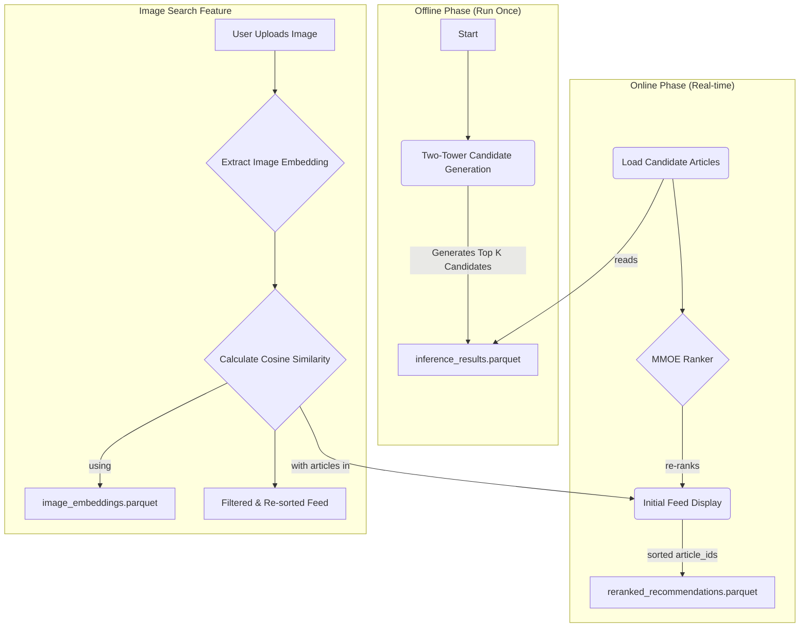

# H&M Two-Step Recommendation Pipeline

This document provides instructions for running the two-step recommendation pipeline. The system first generates candidate articles using a Two-Tower model, then re-ranks them with an MMOE model, and finally provides an example of an image-based search to refine recommendations.

---

## Pipeline Architecture

The pipeline is divided into two main stages:

1. **Candidate Generation (Offline)**: A Two-Tower model generates a list of top-K candidate articles for all customers. This is a heavy process and is typically run offline periodically.
2. **Re-ranking and Serving (Online/Batch)**: An MMOE model re-ranks the generated candidates. This can be run in batch for all users or for a single user to simulate an online, real-time scenario.



---

## How to Run the Pipeline

### Prerequisites

- Ensure you have the required conda environment set up and all dependencies installed.
- The necessary data files (`articles.csv`, `customers.csv`, `transactions_train.csv`) should be in the `data/` directory.
- Pre-trained model weights for both the Two-Tower and MMOE models must be available in their respective `output` directories.
- Pre-computed image embeddings must be available at `data/image_embeddings.parquet`.

### Step 1: Generate Candidate Articles

This step runs the Two-Tower model to generate top-K candidates for each customer.

Navigate to the `two_tower_cg/refactor` directory and run the inference script. The model version (`-mv`) is a required argument.

```bash
# Navigate to the project root: hm-two-step-reco/
cd two_tower_cg/refactor

# Run the inference script (replace 'v2' with your model version if different)
python .\__inference__.py -mv v2
```

This will create `inference_results.parquet` in the `hm-two-step-reco/output/` directory.

### Step 2: Run the Main Pipeline (Re-ranking and Image Search)

The main pipeline script `recommendation_pipeline.py` handles both re-ranking and the final image search example. It can be run in two modes.

#### Mode 1: Batch Re-ranking for All Customers

This will process all customers found in the `inference_results.parquet` file.

```bash
# Navigate to the project root: hm-two-step-reco/
python recommendation_pipeline.py
```

#### Mode 2: Single Customer Re-ranking (Online Simulation)

You can simulate an online inference scenario by providing a specific `customer_id`. This is useful for testing and debugging.

```bash
# Navigate to the project root: hm-two-step-reco/
# Replace with a valid customer_id from your dataset
python recommendation_pipeline.py --customer_id aa51fd04db21c0d2620a351dc5b94b704922d674b1c52a37225dd25a7a166ee0
```

### Pipeline Output

- **Re-ranked Recommendations**: The script will save the re-ranked article lists to `output/reranked_recommendations.parquet`.
- **Image Search Results**: The final, visually re-sorted recommendations for the example user and image are printed to the console.

---

## Future Work (TO-DO)

### Image Query Processing Module

A planned future enhancement is a module to handle real-time image queries from users. The intended workflow is as follows:

1. **User Image Upload**: The user provides an image they are interested in.
2. **Embedding Extraction**: The system extracts the feature embedding from the user's image using the same model that generated the pre-computed article image embeddings (already in [image_embeddings.parquet](./data/image_embeddings.parquet)).
3. **Cosine Similarity Ranking**: The user's image embedding is compared against the embeddings of all articles in their personalized, re-ranked feed (the "initial feed display").
4. **Threshold-based Filtering**: Articles with a cosine similarity score above a pre-defined threshold will be selected and presented to the user as visually similar recommendations.
